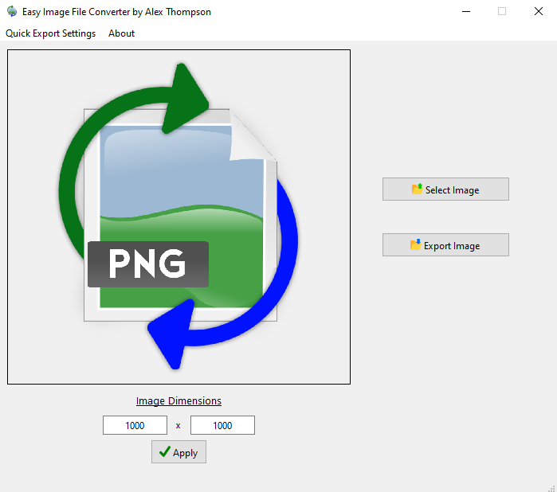
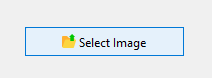
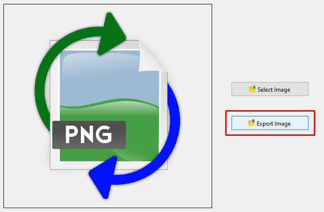
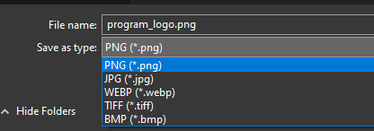

# Easy Image File Type Converter

Easy Image File Type Converter is a simple to use desktop application for Windows that converts images of common file types into other common file types in a few seconds. 
### The current accepted file types for importing and exporting are: PNG, JPG/JPEG, WEBP, TIFF, and BMP. 

## Features
- Convert images to and from the supported file types: PNG, JPG/JPEG, WEBP, TIFF, and BMP.
- Multi-Image Conversion
- Persistant User Settings
- Super Fast Conversion Speeds

## Installation
Currently, this application is only compatbile with Windows computers.

To install the application, please download the Setup Installer located in the Releases section of this page.

### [CLICK HERE TO DOWNLOAD THE APPLICATION](https://github.com/AlexThomp1/Easy-Image-File-Type-Converter/releases/)

## Usage
The application allows for single image conversion and multi-image conversion.

### Single Image Conversion:
1) Open the application
2) Click the Select Image button

3) Find an image to convert
4) Once imported and displayed at the left, click the Export Image button

5) At the bottom left of the pop-up window, change the file type to any of the other options

6) Find a location to export the new image file
7) Once exported, the new image file has been exported successfully

### Multi-Image Conversion:
1) Open the application
2) On your computer, select multiple image files
3) Drag and Drop the selected files on top of the opened application
4) Wait until all images have been converted successfully

Multi-Image Conversion uses the Default File Location and Default File Type selected in the "Quick Export Settings".

### Quick Export Settings:
- Default File Location: If not enabled, the multi-image conversion will automatically place the converted file in the same location as the original image.
- If enabled, you may select a location for the multi-image conversion to automatically export the new image files to.
- Default File Type: Select which file type you want the multi-image conversion to automatically convert the new image files to.

